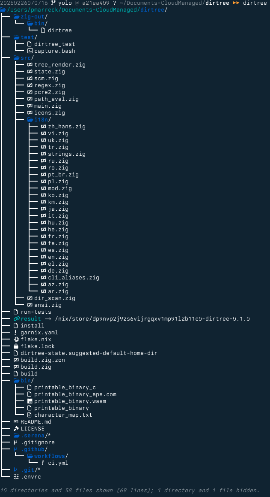
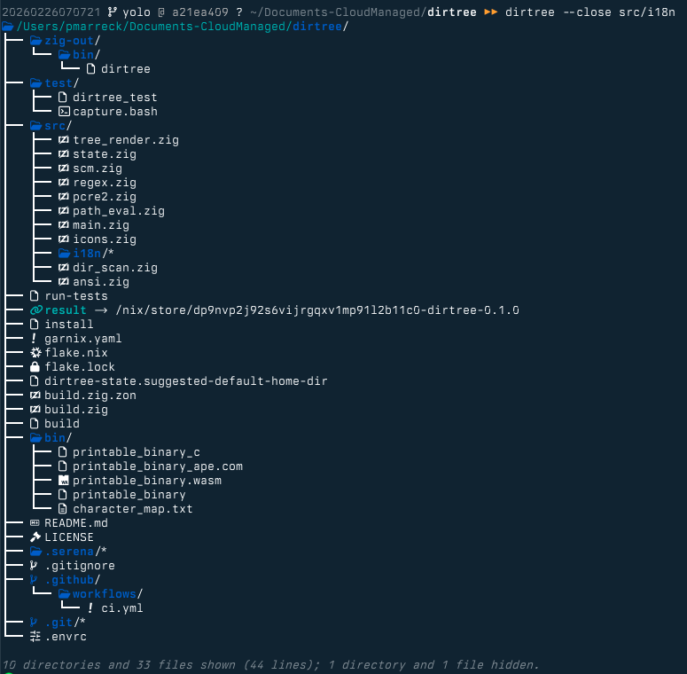
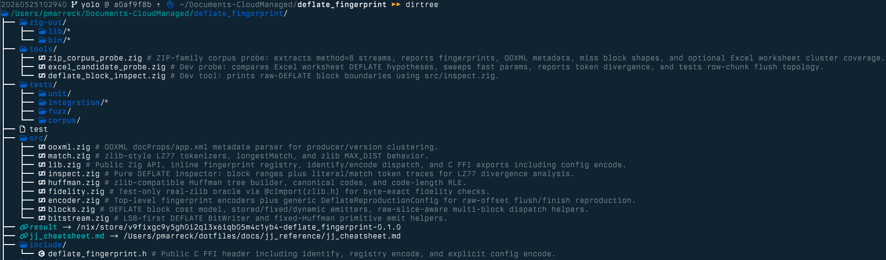

# dirtree
[](https://github.com/pmarreck/dirtree/actions/workflows/ci.yml) [](https://garnix.io/repo/pmarreck/dirtree)

`dirtree` is a native Zig CLI that produces stateful directory trees. It aims to make it easy for humans—and tooling like LLM pair-programmers—to share a consistent view of a project hierarchy without drowning in noise from build artifacts, vendor bundles, or other clutter.

<table><tr>
<td align="center"><strong>Opened</strong></td>
<td align="center"><strong>Closed</strong></td>
</tr><tr>
<td><picture><source srcset="assets/images/open.jxl" type="image/jxl" /></picture></td>
<td><picture><source srcset="assets/images/closed.jxl" type="image/jxl" /></picture></td>
</tr><tr>
<td colspan="2" align="center"><strong>With annotations</strong></td>
</tr><tr>
<td colspan="2"><picture><source srcset="assets/images/annotations.jxl" type="image/jxl" /></picture></td>
</tr></table>

## Use case

- Capture and persist the "interesting" parts of a repository's structure by closing noisy directories or hiding file types you rarely need.
- Share tree snapshots that match what you normally see locally, so collaborators (human or AI) have the same mental model of the project layout.
- Switch between a decorated tree (with icons, hyperlinks, colors) and a simplified, glyph-free output that's LLM-friendly.

## Download

Pre-built binaries are attached to each [release](https://github.com/pmarreck/dirtree/releases). Grab the one for your platform:

| Platform                | Binary                                                                                                                  |
|-------------------------|-------------------------------------------------------------------------------------------------------------------------|
| macOS (Apple Silicon)   | [dirtree-aarch64-macos](https://github.com/pmarreck/dirtree/releases/latest/download/dirtree-aarch64-macos)             |
| macOS (Intel)           | [dirtree-x86_64-macos](https://github.com/pmarreck/dirtree/releases/latest/download/dirtree-x86_64-macos)               |
| Linux (x86_64, musl)    | [dirtree-x86_64-linux-musl](https://github.com/pmarreck/dirtree/releases/latest/download/dirtree-x86_64-linux-musl)     |
| Linux (aarch64, musl)   | [dirtree-aarch64-linux-musl](https://github.com/pmarreck/dirtree/releases/latest/download/dirtree-aarch64-linux-musl)   |

Then make it executable and put it on your `PATH`:

```bash
chmod +x dirtree-*
sudo mv dirtree-* /usr/local/bin/dirtree
```

Bleeding-edge rolling builds from every push to `yolo` are at the [`latest` prerelease](https://github.com/pmarreck/dirtree/releases/tag/latest) (same filenames, different tag).

## Features

- **Persistent state per directory** via `.dirtree-state` (stored in a concise INI-MA format):
  - Default directory state (`opened`/`closed`).
  - Explicit open/close rules.
  - Show/hide filters for literals and regex patterns.
  - Per-path annotations (one-line descriptions rendered inline as `# comment` in dim text).
  - Automatic migration from legacy key/value state.
- **Flexible matching**
  - Regexes operate on full relative paths, enabling scoped rules like `src/.*_test`.
  - Literal paths allow quick toggling of individual files or directories.
- **Runtime toggles**
  - `--show-hidden` temporarily reveals everything hidden by config.
  - Hidden directories/files are counted and summarized after each run (decorated mode uses dim italics; simple mode prints plain text).
- **Decorated vs simple output**
  - Decorated mode renders Nerd Font icons, ANSI colors, and OSC8 hyperlinks whenever stdout is a TTY or you force it with `--decorated`. When dirtree detects a pipe, it automatically falls back to monochrome icons and no hyperlinks for log-friendly output unless you opt in via `--decorated` or `PIPED_STDOUT=0`.
  - Simple mode keeps the same tree connectors and monochrome icons but strips ANSI color/hyperlink sequences so LLMs or diff tools get a stable, plaintext-friendly listing (toggle glyphs with `--no-icons`).
  - Auto-simple mode can kick in for non-TTY outputs via `DIRTREE_AUTO_SIMPLE`.
  - Prefer decorating or simplifying via environment? Set `DIRTREE_SIMPLE=1` or `DIRTREE_DECORATED=1` to force either mode without changing scripts.
- **Deterministic decoration toggles**
  - `--no-icons`, `--no-color`, and `--no-hyperlinks` disable icons, ANSI colors, or OSC8 hyperlinks and persist those preferences (`icon=false`, `color=false`, `hyperlink=false`) in `.dirtree-state` so future runs inherit the same style. Use them when you need diff-friendly logs or reproducible CI artifacts; delete the key or override with `--decorated`/`PIPED_STDOUT=0` when you want rich output again.
- **SCM awareness**
  - When a Git or Jujutsu repo is detected, paths reported as modified/untracked are forced visible and opened even if state rules would hide them. Set `DIRTREE_SCM_CHANGES_STAY_HIDDEN_OR_CLOSED=1` to opt out.
- **CLI conveniences**
  - `--open`, `--close`, `--show`, `--hide` accept multiple values and regexes using the `/pattern/` form.
  - `--default` and `--sort` options to tune depth and ordering.
  - `--test` hook to run the bash test suite.
  - `--no-icons`, `--no-color`, and `--no-hyperlinks` disable individual decorations (and persist that choice) when you truly need plain text.
  - `dirtree annotate PATH "description"` (alias `note`) persists a one-line note about a file or directory; pass an empty string to clear it. Notes display inline next to the entry as a dim `# comment`. Notes are also inherited from parent `.dirtree-state` files, with the closer file overriding.
  - `dirtree orphaned-notes [DIR]` lists notes in the current directory's `.dirtree-state` whose target paths no longer exist; `dirtree purge-orphaned-notes [DIR]` removes them (reporting each one). After any listing, dirtree also prints a one-line stderr warning when such orphaned notes exist — suppress it for a run with `--no-orphan-warning`.
  - Notes show inline by default. Hide them for a run with `--no-notes` (or set `DIRTREE_HIDE_NOTES=1` to hide by default); `--show-notes` forces them back on, overriding the env var. This is display-only and never persisted.
  - If a directory name looks like a flag or a subcommand (e.g. `--config` or `annotate`), force it to be read as the path: `dirtree --path <name>` (alias `-p`), or use the standard end-of-options separator `dirtree -- <name>` — everything after `--` is treated as the path, never as a flag or subcommand (so `dirtree -- --path` even lists a directory literally named `--path`).
- **Safety niceties**
  - Number of hidden directories/files logged to stderr so you know what's filtered out.
  - Conflicting rules (e.g., same regex in open/close) surface as errors.
  - Unknown lines in the state file are preserved on rewrite.
- **Cross-platform**
  - Native Zig binary with zero runtime dependencies. Cross-compiles to macOS, Linux, and Windows from any host.

## Dependencies

**None at runtime.** `dirtree` is a self-contained native binary.

Build dependencies:
- [Zig](https://ziglang.org/) 0.16+ (or use the Nix flake)

## Getting started

```bash
# Build from source
./build

# Generate a tree with defaults
dirtree

# Collapse vendor directory and hide .log files
dirtree --close vendor --hide '/\.log$/'

# Temporarily show everything that is hidden
dirtree --show-hidden

# Annotate a file (or directory) — appears inline as a dim '# comment'
dirtree annotate src/main.zig "CLI entry point"
dirtree note     src/state.zig "INI-MA parser/writer"  # 'note' is a synonym
dirtree annotate src/main.zig ""                       # clears the note
```

### Using Nix

```bash
# Enter dev shell with Zig
nix develop

# Or build directly
nix build
./result/bin/dirtree
```

State lives in `.dirtree-state` at the root of whatever directory you run `dirtree` inside. Commit or share those files if you want collaborators (or your future self) to inherit the same view. `dirtree` never creates or edits a state file unless you explicitly ask it to persist changes (e.g., via `--default`, `--open`, `--hide`, etc.), so you can safely inspect trees without committing to a config.

The repo includes `dirtree-state.suggested-default-home-dir`, a sample config you can copy to `$HOME/.dirtree-state` if you want global defaults that apply to every subdirectory beneath your home directory. Feel free to tweak it to match your own "baseline" structure before adopting it.

### Sorting and depth (persistent)

- `-d/--depth N` changes how deep the tree is rendered (default depth is 4) and writes that depth into `.dirtree-state`, so future runs inherit the same cutoff unless you override it again.
- `-td/--temp-depth N` overrides the render depth for the current run only and is **not** persisted to `.dirtree-state` — use it for a one-off deeper or shallower peek without changing the saved cutoff.
- `--sort MODE` accepts `modified` (default, newest-first) or `alpha` (lexicographic). Pair it with `--asc` or `--desc` to flip the direction. Both the mode and direction are persisted per directory so you only have to set them once.

### Mode environment variables

- `DIRTREE_SIMPLE=1` forces simple mode without passing `--simple`.
- `DIRTREE_DECORATED=1` behaves like `--decorated`, keeping colors, hyperlinks, and glyphs even when piping dirtree's output.
- `DIRTREE_AUTO_SIMPLE=1` automatically switches to simple mode whenever stdout isn't a TTY.
- `PIPED_STDOUT=0|1` lets you override dirtree's TTY detection in non-interactive contexts (e.g., `PIPED_STDOUT=0` treats a pipe as if it were an interactive terminal, restoring hyperlinks and color for tests or automated runs).

### Version and update checking

`dirtree --version` prints the version number and, if the local cache says a newer release exists, a yellow `Update available: vX.Y.Z` line. No network call is made on this path — the cache is refreshed by `--version-check`.

`dirtree --version-check` hits the GitHub releases API once and:
- updates the cache (success or failure),
- prints `Update available`, `Up to date.`, or "ahead of latest" accordingly,
- exits non-zero on network failure and prints the error to stderr.

The cache lives at `${XDG_CACHE_HOME:-$HOME/.cache}/dirtree/update_check`. It's refreshed automatically once per UTC day, or whenever the binary's mtime changes (i.e., after an install). Failed checks back off exponentially (1s, 2s, 4s, …, capped at one day) so a network outage doesn't slow every invocation. Set `DIRTREE_UPDATE_URL` to override the endpoint (useful for tests).

Respecting `NO_COLOR` is automatic.
## Tests

Run all tests (Zig unit tests + bash integration tests):

```bash
./run-tests
```

Or individually:

```bash
# Zig unit tests
zig build test

# Bash integration tests (103 tests)
./test/dirtree_test

# From anywhere on your PATH:
dirtree --test
```

Both the CLI and the tests default `TMPDIR` to `/tmp` (unless you already set it) so every `mktemp` call lands on the RAM-backed volume—important on macOS, which might otherwise choose `/var/folders/...`.

They cover CLI flags, persistence, migration, SCM overrides, hidden summaries, and interaction with the simple/decorated modes.

## Architecture

The current Zig implementation renders trees natively without any external dependencies.
